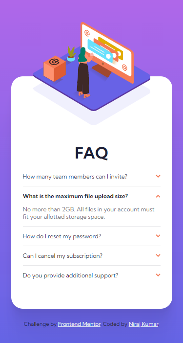

# FAQ accordion card solution

This is a solution to the [FAQ accordion card challenge on Frontend Mentor](https://www.frontendmentor.io/challenges/faq-accordion-card-XlyjD0Oam). Frontend Mentor challenges help you improve your coding skills by building realistic projects.

## Table of contents

-   [Overview](#overview)
    -   [The challenge](#the-challenge)
    -   [Screenshot](#screenshot)
    -   [Links](#links)
-   [My process](#my-process)
    -   [Built with](#built-with)
    -   [What I learned](#what-i-learned)
-   [Author](#author)

## Overview

### The challenge

Users should be able to:

-   View the optimal layout for the component depending on their device's screen size
-   See hover states for all interactive elements on the page
-   Hide/Show the answer to a question when the question is clicked

### Screenshot

### Links

-   Solution URL: [Check My Solution on Frontend Mentor](#author)
-   Live Site URL: [FAQ accordion card](https://niraj-faq-accordion-card.netlify.app/)

## My process

### Built with

-   Semantic HTML5 markup
-   CSS custom properties
-   Flexbox
-   Mobile-first workflow
-   JavaScript

### What I learned

-   Learned how to work with JavaScript in the Browser using DOM.
-   `.nextSibling` will treat even space as the next sibling, so use `.nextElementSibling`.
-   We can change the img src using JS, but most of the times, using picture element tag works better.

## Author

<!-- -   Website - [Add your name here](https://www.your-site.com) -->

-   Frontend Mentor - [@niraj-kumar-r](https://www.frontendmentor.io/profile/niraj-kumar-r)
-   Twitter - [@niraj-kumar-r](https://twitter.com/niraj_kumar_r)
-   Linked In - [@niraj-kumar-r](https://www.linkedin.com/in/niraj-kumar-r/)
